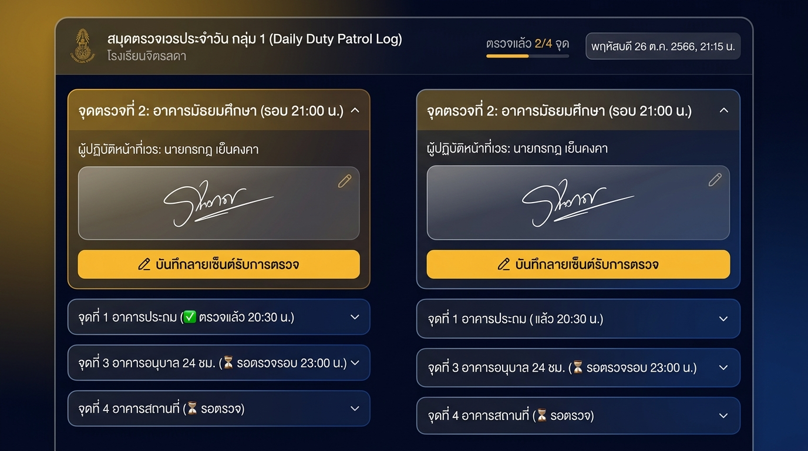
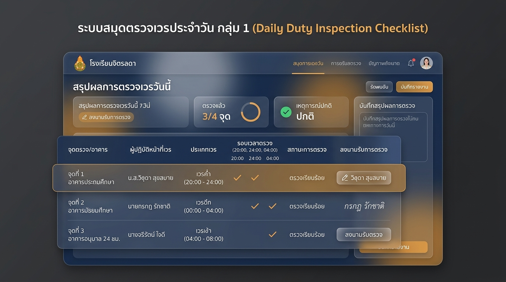
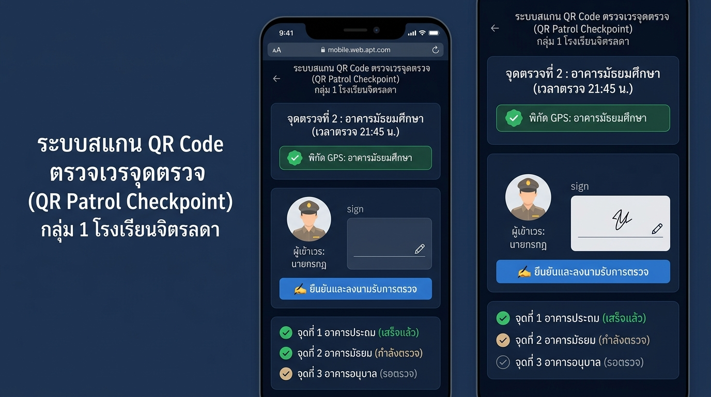

# 📌 แนวทางการพัฒนาระบบ "การตรวจเวรและลงนามยืนยันประจำวัน" (กลุ่ม 1)
**โรงเรียนจิตรลดา — ระบบตารางเวรและบันทึกเวรประจำวัน**  
*บันทึกเมื่อ: ๘ กันยายน ๒๕๖๙*

---

## 🎯 ที่มาและความต้องการ (Requirement Background)
ในกลุ่ม 1 (เวรอาคารสถานที่: งานช่าง, ไฟฟ้า, ความสะอาด, ยานพาหนะ, เวรอนุบาล 24 ชม.) มีภารกิจหลักในการเดินตรวจตราความเรียบร้อยรอบโรงเรียนทุกชั่วโมง  
จึงมีข้อเสนอแนะว่า: **"ในกลุ่ม 1 จะต้องมีการตรวจเวร และต้องการให้ผู้เข้าเวรในแต่ละวันเข้ามาลงลายเซ็นต์รับรองการตรวจ"**

---

## ⭐ แนวทางที่ลงตัวที่สุด: "ลูกผสม (แนวคิดที่ 2 + หน้าตาแนวทางที่ 3)"
> **แนวคิด:** ใช้ระบบสมุดตรวจเวรประจำวันของกลุ่ม 1 (ไม่ต้องยุ่งยากไปสแกน QR Code)  
> **หน้าตา UI:** ใช้การ์ดโมบายล์ทันสมัย (Mobile Checkpoint Cards) แตะเซ็นชื่อได้ง่ายบนมือถือ

#### 🖼️ ภาพตัวอย่างหน้าจอจำลอง (Hybrid Mockup):

### จุดเด่นและการทำงาน:
1. **ถือมือถือเดินตรวจสบายๆ**:
   - กลุ่ม 1 เปิดแท็บ **"สมุดตรวจเวร (กลุ่ม 1)"** บนสมาร์ทโฟน
   - ระบบจะดึงรายชื่อผู้เข้าเวรทุกจุดของวันนั้นขึ้นมาเป็นการ์ด 4 จุดตรวจอัตโนมัติ:
     - 🏫 **จุดที่ 1: อาคารประถมศึกษา**
     - 🏫 **จุดที่ 2: อาคารมัธยมศึกษา**
     - 🏫 **จุดที่ 3: อาคารอนุบาล (24 ชม.)**
     - 🏫 **จุดที่ 4: เวรอาคารสถานที่**
2. **แตะเปิดการ์ดเพื่อลงนาม (Collapsible Checkpoint Card)**:
   - เมื่อเดินตรวจถึงจุดไหน (เช่น อาคารมัธยมศึกษา) ให้แตะเปิดการ์ดจุดนั้นขึ้นมา
   - จะแสดงชื่อครู/เจ้าหน้าที่ผู้เข้าเวร (เช่น นายกรกฎ เย็นคงคา)
   - มีกล่องลายเซ็นต์ดิจิทัล ให้ผู้เข้าเวรแตะเซ็นชื่อด้วยนิ้วมือบนหน้าจอทันที
   - กดปุ่ม **"✍️ บันทึกลายเซ็นต์รับการตรวจ"**
3. **การ์ดเปลี่ยนสถานะอัตโนมัติ**:
   - เมื่อเซ็นเสร็จ การ์ดจะขึ้นเครื่องหมายถูกสีเขียว `✅ ตรวจแล้ว (20:30 น.)` และย่อเก็บลงไป
   - แถบด้านบนจะอัปเดตความคืบหน้า เช่น `ตรวจแล้ว 2/4 จุด`
4. **เชื่อมโยงข้อมูลสู่ใบพิมพ์ A4 โดยตรง**:
   - ลายเซ็นต์และเวลาที่กลุ่ม 1 เดินตรวจนี้ จะถูกส่งไปประทับในใบบันทึกเวรประจำวันของครูท่านนั้นโดยอัตโนมัติ เมื่อพิมพ์เอกสาร A4 ก็จะมีข้อมูลตรวจเวรครบถ้วนตามระเบียบทันที

---

## 💡 ภาพรวมแนวทางเดิมทั้ง 3 แบบ (สำหรับอ้างอิง)

### 🔹 แนวทางที่ 1: "ช่องเซ็นผู้ตรวจเวรคู่ในใบเวรเดิม" (Dual Signature)
- เพิ่มช่องเซ็นชื่อผู้ตรวจเวรในใบเวรเดิมของครูแต่ละท่าน

### 🔹 แนวทางที่ 2: "สมุดตรวจเวรรวมประจำวัน" (Patrol Checklist Dashboard)
- รวมรายชื่อเวรทุกคนในตารางแดชบอร์ด
- *ภาพหน้าจอเดิม:* 

### 🔹 แนวทางที่ 3: "สแกน QR Code ตรวจเวรตามจุด" (QR Patrol & Checkpoint)
- หน้าจอมือถือสวยงาม แต่ต้องติดตั้งป้าย QR Code ตามอาคาร
- *ภาพหน้าจอเดิม:* 

---

## 🎯 สรุปผลการเลือกแบบ
**แนวทางลูกผสม (Hybrid)** นี้ตอบโจทย์ที่สุด เพราะ:
- ใช้งานง่าย ไม่ต้องพิมพ์กระดาษหลายรอบ
- ถือมือถือเดินตรวจรอบโรงเรียนได้สะดวกมาก
- หน้าจอสวยงาม คมชัดในโหมดมืด (Dark Theme) และเข้ากับดีไซน์ใหม่ของโรงเรียนจิตรลดาครับ
